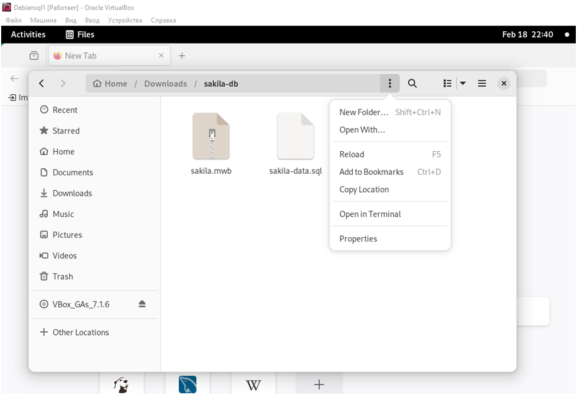
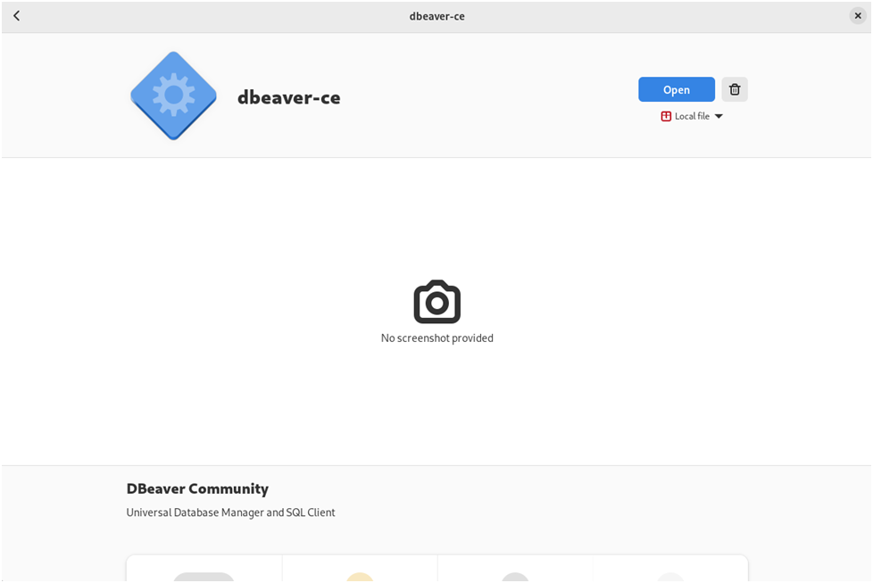

***Домашнее задание Симкиной Т.А.***

Задание 1
1.1. Поднимите чистый инстанс MySQL версии 8.0+. Можно использовать локальный сервер или контейнер Docker.

Решение:

apt-get install gnupg

sudo apt update

sudo apt install mysql-server

1.2. Создайте учётную запись sys_temp.

Вход в консоль MySQL: mysql -u root –p

CREATE USER 'sys_temp'@'localhost' IDENTIFIED BY 'password';
создаёт пользователя MySQL с именем sys_temp, доступом только с локального компьютера и паролем password.

1.3. Выполните запрос на получение списка пользователей в базе данных. (скриншот)

SELECT User, Host FROM mysql.user;

1.4. Дайте все права для пользователя sys_temp.

GRANT ALL PRIVILEGES ON *.* TO 'sys_temp'@'localhost';

1.5. Выполните запрос на получение списка прав для пользователя sys_temp. (скриншот)

SHOW GRANTS FOR 'sys_temp'@'localhost';

1.6. Переподключитесь к базе данных от имени sys_temp.

mysql -u sys_temp -p

Для смены типа аутентификации с sha2 используйте запрос:

ALTER USER 'sys_test'@'localhost' IDENTIFIED WITH mysql_native_password BY 'password';

1.6. По ссылке https://downloads.mysql.com/docs/sakila-db.zip скачайте дамп базы данных.

sudo apt install unzip -y
установим unzip

unzip ./sakila-db.zip 

1.7. Восстановите дамп в базу данных.

Восстановление базы данных.
https://downloads.mysql.com/docs/sakila-db.zip
Скачаем дамп по пути https://downloads.mysql.com/docs/sakila-db.zip
Разархивируем и запомним путь к разархивированной части;

CREATE DATABASE db1 DEFAULT CHARACTER SET utf8 DEFAULT COLLATE utf8_general_ci;
GRANT ALL PRIVILEGES ON db1.* TO 'root'@'localhost';
exit;
cd Downloads
cd sakila-db
mysql -u root -p db1 < sakila-schema.sql;
mysql -u root -p db1 < sakila-data.sql;

1.8. При работе в IDE сформируйте ER-диаграмму получившейся базы данных. При работе в командной строке используйте команду для получения всех таблиц базы данных. (скриншот)

установим Dbevar для получения красивой ER диаграммы.
Зайдем на сайт Dbevar

Скачиваем версию для Debian

Выбираем Open With

Software install
Потом Open

Запустим Dbebar подключимся к базе данных и просморим Er диаграмму

Задание 2
Составьте таблицу, используя любой текстовый редактор или Excel, в которой должно быть два столбца: в первом должны быть названия таблиц восстановленной базы, во втором названия первичных ключей этих таблиц. Пример: (скриншот/текст)

Название таблицы | Название первичного ключа
customer         | customer_id

table_name	          |                 primary_key_name
actor	              |                     actor_id
address	              |                      address_id
category              |                  	category_id
city	              |                       city_id
country               |                   	country_id
customer              |                       	customer_id
film                  |                     	film_id
film_actor            |                     	actor_id
film_actor	          |                        film_id
film_category	      |                         film_id
film_category	      |                      category_id
film_text	          |                        film_id
inventory	          |                             inventory_id
language              |                   	language_id
payment               |                    	payment_id
rental	              |                        rental_id
staff                 |                      staff_id
store	              |                     store_id

